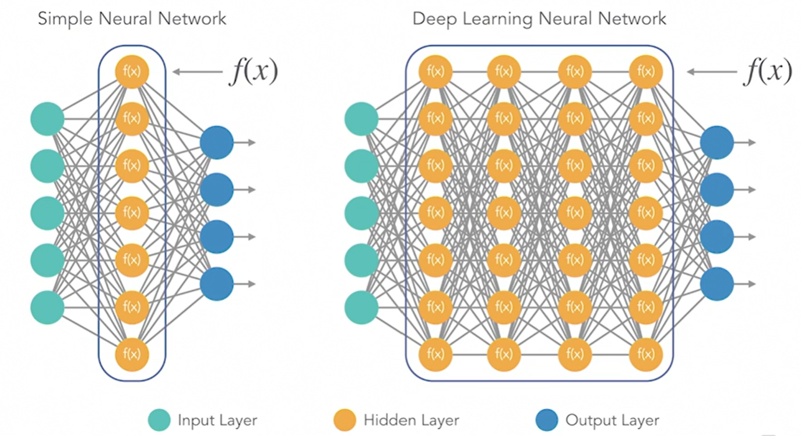
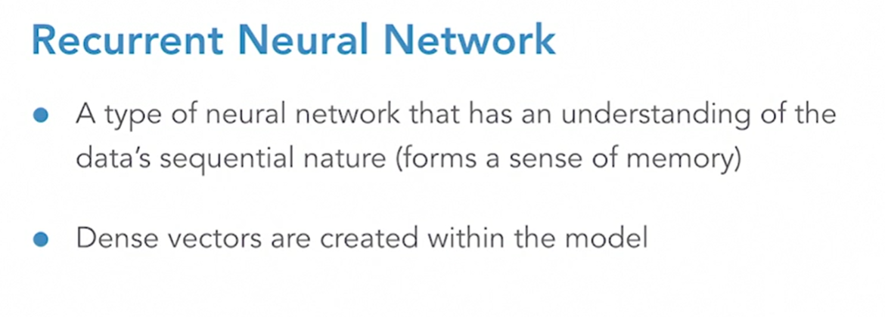

# Advanced NLP with_Python LinkdIn Learning

This repo was created while following along with LinkedIn Learning certification program [Advanced NLP with Python for Machine Learning](https://www.linkedin.com/learning/advanced-nlp-with-python-for-machine-learning/leveraging-the-power-of-messy-text-data?autoAdvance=true&autoSkip=false&autoplay=true&resume=true), taught by [Derek Jedamski](https://www.linkedin.com/learning/instructors/derek-jedamski).

An incredible amount of unstructured text data is generated every day by social media, web pages, and a variety of other sources. But without the ability to tame and harness that data, you'll be unable to glean any value from it. In this course, learn how to translate messy text data into powerful insights using Python. Instructor Derek Jedamski begins with a quick review of foundational NLP concepts, including how to clean text data and build a model on top of vectorized text. He then jumps into more complex topics such as word2vec, doc2vec, and recurrent neural networks. To wrap up the course, he lends these concepts a real-world context by applying them to a machine learning problem.

# Key Slides:
## TF-IDF

## word2vec

## doc2vec

## Neural Network

## Recurrent Neural Netword

## Comparisons

## Results

## Takeaways

